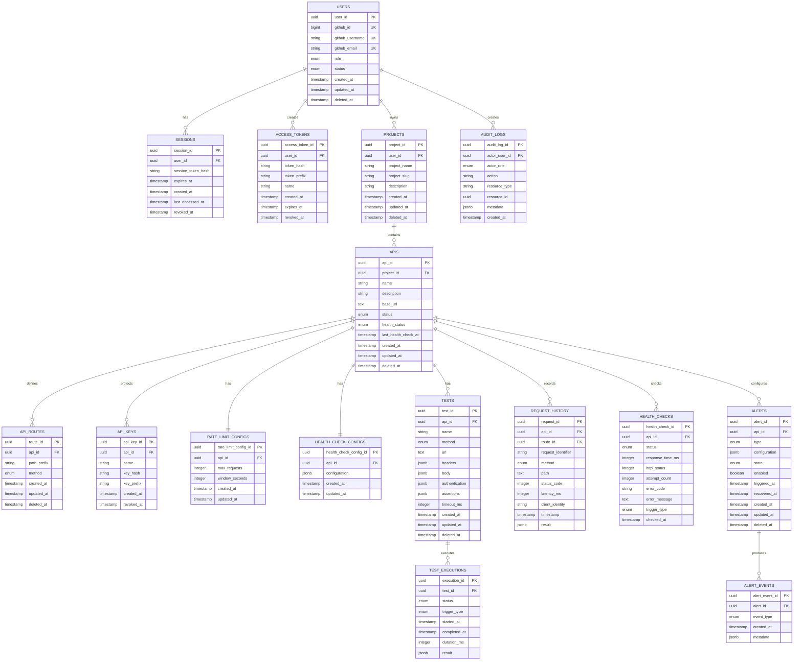

# GateWatch — Data Model

## 1. Database Overview

GateWatch uses **PostgreSQL** as the authoritative persistent data store.

The database uses the default `public` schema and stores users, projects, APIs, gateway configuration, tests, monitoring history, alerts, sessions, audit records, and other persistent application state.

Redis is used only for runtime/cache data such as:

- Active session cache
- API configuration cache
- Rate-limit counters
- Other temporary runtime state

PostgreSQL remains the source of truth when Redis data is missing or invalid.

### Database Conventions

- PostgreSQL UUIDs are used for primary keys.
- Primary keys use explicit entity names such as `user_id`, `project_id`, and `api_id`.
- Foreign keys use the corresponding `<entity>_id` convention.
- Timestamps use `TIMESTAMPTZ`.
- Application data is stored in UTC.
- The frontend displays timestamps in `Asia/Kolkata`.
- Soft-deletable resources use `deleted_at`.
- Flexible structures use PostgreSQL `JSONB`.
- Stable finite states use PostgreSQL enums.
- Database hard deletion is restricted where historical relationships must be preserved.

---

## 2. ER Diagram



---

## 3. Entity List

| Entity | Purpose |
| --- | --- |
| `users` | GateWatch user accounts and roles |
| `sessions` | Server-side browser authentication sessions |
| `access_tokens` | Programmatic GateWatch API authentication for CI/CD and trusted clients |
| `projects` | User-owned logical groups of APIs and related resources |
| `apis` | Registered upstream APIs |
| `api_routes` | Gateway route definitions for APIs |
| `api_keys` | Credentials used by clients to access protected upstream APIs through GateWatch |
| `rate_limit_configs` | Per-API rate-limit configuration |
| `health_check_configs` | Per-API health-check configuration |
| `tests` | HTTP API test definitions |
| `test_executions` | Results of test executions |
| `request_history` | Persisted gateway request history |
| `health_checks` | Historical health-check executions |
| `alerts` | Alert configurations and current alert state |
| `alert_events` | Trigger/recovery history for alerts |
| `audit_logs` | User and Admin activity records |

---

## 4. Entity Responsibilities

### Users

Stores GitHub identity, GateWatch role, lifecycle state, and account timestamps.

### Sessions

Stores server-side session state. The browser receives an HTTP-only cookie containing the session identifier/token, while the server stores the corresponding secure representation.

### Access Tokens

Provides non-browser authentication for trusted programmatic clients such as CI/CD systems.

An access token does not automatically grant unrestricted access to every resource owned by the user. Normal authentication, ownership, authorization, and resource checks still apply.

### Projects

Provides the ownership boundary and logical grouping for APIs and their associated resources.

### APIs

Defines the registered upstream API, its lifecycle state, current health state, and base upstream URL.

### API Routes

Defines the public gateway route prefixes and allowed HTTP methods for an API.

### API Keys

Stores credentials used by clients to authenticate against protected registered APIs.

### Rate Limit Configurations

Stores the maximum request count and fixed time window for an API.

### Health Check Configurations

Stores configurable health-check behavior for an API.

### Tests

Stores HTTP test definitions and their assertions.

### Test Executions

Stores execution metadata and assertion results without persisting the complete upstream response.

### Request History

Stores summarized gateway traffic information for user-facing request history.

### Health Checks

Stores summarized automatic and manual health-check results.

### Alerts

Stores alert rules, configuration, enabled state, and current trigger state.

### Alert Events

Stores individual alert trigger and recovery events.

### Audit Logs

Stores immutable records of relevant User and Admin actions.

---

## 5. Table Structures

### 5.1 `users`

| Column | Type | Constraints |
| --- | --- | --- |
| `user_id` | UUID | PK |
| `github_id` | BIGINT | UNIQUE, NOT NULL |
| `github_username` | VARCHAR | UNIQUE, NOT NULL |
| `github_email` | VARCHAR | NOT NULL |
| `role` | USER_ROLE | NOT NULL |
| `status` | USER_STATUS | NOT NULL |
| `created_at` | TIMESTAMPTZ | NOT NULL |
| `updated_at` | TIMESTAMPTZ | NOT NULL |
| `deleted_at` | TIMESTAMPTZ | NULL |

### 5.2 `sessions`

| Column | Type | Constraints |
| --- | --- | --- |
| `session_id` | UUID | PK |
| `user_id` | UUID | FK |
| `session_token_hash` | TEXT | UNIQUE, NOT NULL |
| `expires_at` | TIMESTAMPTZ | NOT NULL |
| `created_at` | TIMESTAMPTZ | NOT NULL |
| `last_accessed_at` | TIMESTAMPTZ | NOT NULL |
| `revoked_at` | TIMESTAMPTZ | NULL |

Logout immediately revokes/deletes the session.

### 5.3 `access_tokens`

| Column | Type | Constraints |
| --- | --- | --- |
| `access_token_id` | UUID | PK |
| `user_id` | UUID | FK |
| `token_hash` | TEXT | UNIQUE, NOT NULL |
| `token_prefix` | VARCHAR | NOT NULL |
| `name` | VARCHAR | NOT NULL |
| `created_at` | TIMESTAMPTZ | NOT NULL |
| `expires_at` | TIMESTAMPTZ | NULL |
| `revoked_at` | TIMESTAMPTZ | NULL |

The complete token is displayed only at creation.

### 5.4 `projects`

| Column | Type | Constraints |
| --- | --- | --- |
| `project_id` | UUID | PK |
| `user_id` | UUID | FK |
| `project_name` | VARCHAR | NOT NULL |
| `project_slug` | VARCHAR | NOT NULL |
| `description` | TEXT | NULL |
| `created_at` | TIMESTAMPTZ | NOT NULL |
| `updated_at` | TIMESTAMPTZ | NOT NULL |
| `deleted_at` | TIMESTAMPTZ | NULL |

Project names and slugs are unique per user.

Gateway routes use:

```
gatewatch.com/p/{project-slug}/{path}
```

### 5.5 `apis`

| Column | Type | Constraints |
| --- | --- | --- |
| `api_id` | UUID | PK |
| `project_id` | UUID | FK |
| `name` | VARCHAR | NOT NULL |
| `description` | TEXT | NULL |
| `base_url` | TEXT | NOT NULL |
| `status` | API_STATUS | NOT NULL |
| `health_status` | HEALTH_STATUS | NOT NULL |
| `last_health_check_at` | TIMESTAMPTZ | NULL |
| `created_at` | TIMESTAMPTZ | NOT NULL |
| `updated_at` | TIMESTAMPTZ | NOT NULL |
| `deleted_at` | TIMESTAMPTZ | NULL |

`base_url` is validated by the application.

### 5.6 `api_routes`

| Column | Type | Constraints |
| --- | --- | --- |
| `route_id` | UUID | PK |
| `api_id` | UUID | FK |
| `path_prefix` | VARCHAR | NOT NULL |
| `method` | HTTP_METHOD | NOT NULL |
| `created_at` | TIMESTAMPTZ | NOT NULL |
| `updated_at` | TIMESTAMPTZ | NOT NULL |
| `deleted_at` | TIMESTAMPTZ | NULL |

A route is registered for a specific HTTP method. There is no nullable method representing "all methods". If a user wants multiple methods, each method is explicitly registered.

Example:

```
/users → GET
/users → POST
/users → DELETE
```

### 5.7 `api_keys`

| Column | Type | Constraints |
| --- | --- | --- |
| `api_key_id` | UUID | PK |
| `api_id` | UUID | FK |
| `name` | VARCHAR | NOT NULL |
| `key_hash` | TEXT | UNIQUE, NOT NULL |
| `key_prefix` | VARCHAR | NOT NULL |
| `created_at` | TIMESTAMPTZ | NOT NULL |
| `revoked_at` | TIMESTAMPTZ | NULL |

GateWatch API keys are intended for trusted server-side clients. They must not be embedded in public frontend code or exposed to end users.

### 5.8 `rate_limit_configs`

| Column | Type | Constraints |
| --- | --- | --- |
| `rate_limit_config_id` | UUID | PK |
| `api_id` | UUID | UNIQUE, FK |
| `max_requests` | INTEGER | NOT NULL |
| `window_seconds` | INTEGER | NOT NULL |
| `created_at` | TIMESTAMPTZ | NOT NULL |
| `updated_at` | TIMESTAMPTZ | NOT NULL |

One configuration exists per API.

### 5.9 `health_check_configs`

| Column | Type | Constraints |
| --- | --- | --- |
| `health_check_config_id` | UUID | PK |
| `api_id` | UUID | UNIQUE, FK |
| `configuration` | JSONB | NOT NULL |
| `created_at` | TIMESTAMPTZ | NOT NULL |
| `updated_at` | TIMESTAMPTZ | NOT NULL |

The system-level automatic health-check interval is 60 seconds and is not stored on individual health-check execution records.

### 5.10 `tests`

| Column | Type | Constraints |
| --- | --- | --- |
| `test_id` | UUID | PK |
| `api_id` | UUID | FK |
| `name` | VARCHAR | NOT NULL |
| `method` | HTTP_METHOD | NOT NULL |
| `url` | TEXT | NOT NULL |
| `headers` | JSONB | NULL |
| `body` | JSONB | NULL |
| `authentication` | JSONB | NULL |
| `assertions` | JSONB | NOT NULL |
| `timeout_ms` | INTEGER | NOT NULL |
| `created_at` | TIMESTAMPTZ | NOT NULL |
| `updated_at` | TIMESTAMPTZ | NOT NULL |
| `deleted_at` | TIMESTAMPTZ | NULL |

`url` represents the upstream test target by default.

No separate `test_assertions` table is used for the MVP.

### 5.11 `test_executions`

| Column | Type | Constraints |
| --- | --- | --- |
| `execution_id` | UUID | PK |
| `test_id` | UUID | FK |
| `status` | TEST_EXECUTION_STATUS | NOT NULL |
| `trigger_type` | TEST_TRIGGER_TYPE | NOT NULL |
| `started_at` | TIMESTAMPTZ | NOT NULL |
| `completed_at` | TIMESTAMPTZ | NULL |
| `duration_ms` | INTEGER | NULL |
| `result` | JSONB | NOT NULL |

The `result` field contains overall and individual assertion results.

Complete upstream responses are not persisted.

### 5.12 `request_history`

| Column | Type | Constraints |
| --- | --- | --- |
| `request_id` | UUID | PK |
| `request_identifier` | VARCHAR | NOT NULL |
| `api_id` | UUID | FK |
| `route_id` | UUID | FK |
| `method` | HTTP_METHOD | NOT NULL |
| `path` | TEXT | NOT NULL |
| `status_code` | INTEGER | NOT NULL |
| `latency_ms` | INTEGER | NOT NULL |
| `client_identity` | TEXT | NULL |
| `timestamp` | TIMESTAMPTZ | NOT NULL |
| `result` | JSONB | NULL |

Complete request and response bodies are not persisted by default.

### 5.13 `health_checks`

| Column | Type | Constraints |
| --- | --- | --- |
| `health_check_id` | UUID | PK |
| `api_id` | UUID | FK |
| `status` | HEALTH_STATUS | NOT NULL |
| `response_time_ms` | INTEGER | NULL |
| `http_status` | INTEGER | NULL |
| `attempt_count` | INTEGER | NOT NULL |
| `error_code` | VARCHAR | NULL |
| `error_message` | TEXT | NULL |
| `trigger_type` | HEALTH_CHECK_TRIGGER | NOT NULL |
| `checked_at` | TIMESTAMPTZ | NOT NULL |

### 5.14 `alerts`

| Column | Type | Constraints |
| --- | --- | --- |
| `alert_id` | UUID | PK |
| `api_id` | UUID | FK |
| `type` | ALERT_TYPE | NOT NULL |
| `configuration` | JSONB | NOT NULL |
| `state` | ALERT_STATE | NOT NULL |
| `enabled` | BOOLEAN | NOT NULL |
| `triggered_at` | TIMESTAMPTZ | NULL |
| `recovered_at` | TIMESTAMPTZ | NULL |
| `created_at` | TIMESTAMPTZ | NOT NULL |
| `updated_at` | TIMESTAMPTZ | NOT NULL |
| `deleted_at` | TIMESTAMPTZ | NULL |

### 5.15 `alert_events`

| Column | Type | Constraints |
| --- | --- | --- |
| `alert_event_id` | UUID | PK |
| `alert_id` | UUID | FK |
| `event_type` | ALERT_EVENT_TYPE | NOT NULL |
| `created_at` | TIMESTAMPTZ | NOT NULL |
| `metadata` | JSONB | NULL |

### 5.16 `audit_logs`

| Column | Type | Constraints |
| --- | --- | --- |
| `audit_log_id` | UUID | PK |
| `actor_user_id` | UUID | FK |
| `actor_role` | USER_ROLE | NOT NULL |
| `action` | VARCHAR | NOT NULL |
| `resource_type` | VARCHAR | NOT NULL |
| `resource_id` | UUID | NULL |
| `metadata` | JSONB | NULL |
| `created_at` | TIMESTAMPTZ | NOT NULL |

Audit logs are immutable through normal application operations.

---

## 6. Primary Keys

Each persistent entity uses a UUID primary key with an explicit entity name.

Examples:

```
user_id
project_id
api_id
route_id
api_key_id
test_id
execution_id
request_id
health_check_id
alert_id
alert_event_id
audit_log_id
session_id
access_token_id
```

PostgreSQL generates UUID values.

---

## 7. Foreign Keys

Major relationships include:

```
sessions.user_id → users.user_id

access_tokens.user_id → users.user_id

projects.user_id → users.user_id

apis.project_id → projects.project_id

api_routes.api_id → apis.api_id

api_keys.api_id → apis.api_id

rate_limit_configs.api_id → apis.api_id

health_check_configs.api_id → apis.api_id

tests.api_id → apis.api_id

test_executions.test_id → tests.test_id

request_history.api_id → apis.api_id
request_history.route_id → api_routes.route_id

health_checks.api_id → apis.api_id

alerts.api_id → apis.api_id

alert_events.alert_id → alerts.alert_id

audit_logs.actor_user_id → users.user_id
```

Hard deletion is restricted for relationships where historical data must remain available.

---

## 8. Relationships

### User → Projects

One user can own multiple projects.

### Project → APIs

One project can contain multiple APIs.

### API → Routes

One API can have multiple gateway routes.

### API → API Keys

One API can have multiple API keys.

### API → Configuration

Each API has one rate-limit configuration and one health-check configuration.

### API → Tests

One API can have multiple tests.

### Test → Executions

One test can have multiple execution records.

### API → Request History

One API can have many request-history records.

### API → Health Checks

One API can have many health-check records.

### API → Alerts

One API can have multiple alert configurations.

### Alert → Alert Events

One alert can produce multiple trigger/recovery events.

### User → Audit Logs

One user can generate many audit records.

---

## 9. Constraints

### Ownership

Resource access follows:

```
User
  └── Project
       └── API
            └── API resources
```

Authorization is enforced by the application.

### Project Names and Slugs

Project names and slugs are unique per user.

### Route Definitions

Within an API:

```
api_id + path_prefix + method
```

must be unique.

Routes belonging to different projects may reuse the same public path because each project has its own gateway namespace.

### Route Normalization

Route prefixes are normalized during registration.

Canonical route prefixes do not have a trailing slash except `/`.

### API Keys

API key hashes are unique.

Revoked keys cannot authenticate requests.

### Configuration

Each API has one active rate-limit configuration and one active health-check configuration.

### Soft Deletion

Soft-deleted resources are excluded from normal application queries.

Historical records remain available where required.

---

## 10. Indexes

Indexes are defined around common ownership, lookup, dashboard, and history queries.

```
users.github_id UNIQUE
users.github_username UNIQUE

projects(user_id)
projects(user_id, project_name) UNIQUE
projects(user_id, project_slug) UNIQUE

apis(project_id)
apis(project_id, status)

api_routes(api_id)
api_keys(api_id)
api_keys(api_id, revoked_at)

tests(api_id)
test_executions(test_id, started_at)

request_history(api_id, timestamp)
request_history(api_id, status_code, timestamp)

health_checks(api_id, checked_at)

alerts(api_id)
alert_events(alert_id, created_at)

audit_logs(actor_user_id, created_at)

sessions(user_id)
sessions(expires_at)

access_tokens(user_id)
access_tokens(revoked_at)
```

Additional indexes may be introduced when supported by actual query requirements.

---

## 11. Enumerations / Statuses

### `USER_ROLE`

```
USER
ADMIN
```

### `USER_STATUS`

```
ACTIVE
DELETED
ADMIN_DISABLED
```

### `API_STATUS`

```
REGISTERED
ACTIVE
DISABLED
DELETED
```

### `HEALTH_STATUS`

```
HEALTHY
DEGRADED
DOWN
```

### `HTTP_METHOD`

```
GET
POST
PUT
PATCH
DELETE
HEAD
OPTIONS
```

### `TEST_EXECUTION_STATUS`

```
PASSED
FAILED
```

### `TEST_TRIGGER_TYPE`

```
MANUAL
CI_CD
```

### `HEALTH_CHECK_TRIGGER`

```
SCHEDULED
MANUAL
```

### `ALERT_TYPE`

```
API_DOWN
UNHEALTHY_DURATION
ERROR_RATE
LATENCY
```

### `ALERT_STATE`

```
INACTIVE
TRIGGERED
```

### `ALERT_EVENT_TYPE`

```
TRIGGERED
RECOVERED
```

---

## 12. Audit Fields

Most mutable entities use:

```
created_at
updated_at
```

Soft-deletable entities additionally use:

```
deleted_at
```

Credential/session entities use lifecycle-specific fields such as:

```
revoked_at
expires_at
```

All timestamps are stored as `TIMESTAMPTZ` in UTC.

The application converts timestamps to `Asia/Kolkata` for user-facing display.

---

## 13. Data Lifecycle

### User

```
ACTIVE
  ↓
DELETED
  ↓
ACTIVE
```

A deleted user may return through GitHub OAuth according to the defined account restoration behavior.

An administrator can also move a user into:

```
ADMIN_DISABLED
```

which prevents authentication until re-enabled.

### Project

```
Active → Soft Deleted
```

### API

```
REGISTERED → ACTIVE
REGISTERED → DELETED

ACTIVE → DISABLED
ACTIVE → DELETED

DISABLED → ACTIVE
DISABLED → DELETED

DELETED → terminal
```

API lifecycle is independent of health state.

### API Key

```
Active → Revoked
```

### Session

```
Active → Expired
Active → Revoked
```

Logout immediately revokes/deletes the session.

### Access Token

```
Active → Expired
Active → Revoked
```

### Tests / Alerts

Tests and alerts use soft deletion.

### Historical Records

Request history, health checks, test executions, alert events, and audit logs are retained according to the MVP retention policy.

---

## 14. Data Retention

The MVP does not implement automatic data-retention cleanup.

The following data is retained unless explicitly removed through supported lifecycle operations:

- Request history
- Health-check history
- Test execution results
- Alert events
- Audit logs

Production deployments may introduce configurable retention policies later.

Complete request/response bodies and complete test responses are not persisted by default.

---

## 15. Database Migrations

GateWatch uses **Knex migrations** for database schema management.

Migration principles:

- Every schema change is represented by a migration.
- Migrations are committed to Git.
- Migrations must be applied in deterministic order.
- Existing migrations should not be modified after being applied to shared environments.
- Destructive schema changes require explicit review.
- Seed data is kept separate from schema migrations.
- Database changes must remain compatible with the application version being deployed.

Typical workflow:

```
Create migration
      ↓
Review migration
      ↓
Run locally
      ↓
Verify schema
      ↓
Commit migration
      ↓
Apply to deployment environment
```

---

## 16. Seed Data

Seed data is limited to development/demo requirements.

Possible MVP seed data includes:

- Controlled initial Admin configuration
- Demo project
- Demo APIs
- Demo API routes
- Demo rate-limit configuration
- Demo health-check configuration
- Demo tests
- Other non-production demonstration records where required

The first authenticated user is **not automatically promoted to Admin**.

Production credentials, API keys, sessions, and access tokens must never be seeded as static values.